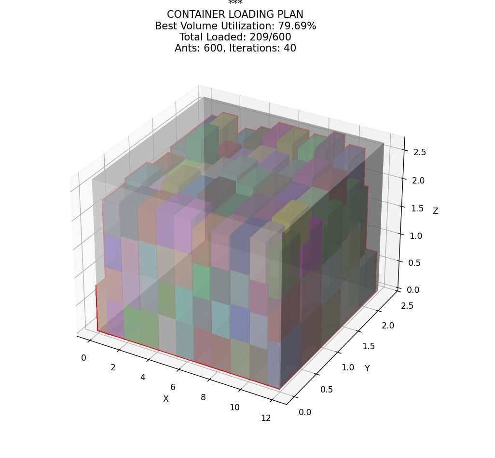

# Chất Xếp Hàng Hóa Dựa trên Ant Colony Optimization (ACO)
## Tổng Quan Dự Án
Dự án này, được thực hiện bởi Nhóm 11 thuộc Khoa Toán - Cơ - Tin học, Trường Đại học Khoa học Tự nhiên, Đại học Quốc gia Hà Nội, tập trung vào việc tối ưu hóa chất xếp hàng hóa lên xe tải bằng thuật toán Ant Colony Optimization (ACO). Nghiên cứu cải tiến thuật toán ACO truyền thống, đề xuất chiến lược xếp hàng dựa trên bức tường (Wall-based ACO - WBACO) để tối ưu hóa không gian, đảm bảo độ ổn định của hàng hóa và tuân thủ các ràng buộc về trọng tâm và tải trọng. Dự án thuộc môn học Tối Ưu Hóa, dưới sự hướng dẫn của TS. Hoàng Nam Dũng, và hoàn thành vào tháng 11 năm 2024.
## Thành Viên Nhóm

### Nguyễn Thị Ánh (22000070)
### Nguyễn Tiến Đạt (22000081)
### Nguyễn Thành Trung (22001672)

## Mục Tiêu

Xây dựng mô hình tối ưu hóa chất xếp hàng hóa lên xe tải dựa trên thuật toán ACO.
Đề xuất chiến lược Wall-based để sắp xếp hợp lý không gian và đảm bảo ổn định hàng hóa.
Đảm bảo các ràng buộc về thể tích, khối lượng và trọng tâm được thỏa mãn.
Tối đa hóa việc sử dụng thể tích xe tải và nâng cao hiệu quả xếp hàng.

## Phương Pháp Thực Hiện
Dự án áp dụng thuật toán ACO cải tiến (WBACO) với các bước chính:

### Mô tả Bài Toán:
Xếp hàng hóa lên xe tải sao cho trọng tâm nằm trong vùng an toàn, hàng hóa ổn định, chịu tải hợp lý và tối đa hóa thể tích sử dụng.
Các giả thuyết: Hàng hóa và xe tải có dạng hình chữ nhật, không biến dạng, trọng tâm gần tâm hình học, và tất cả hàng hóa có ưu tiên như nhau.

### Mô hình Toán học:
Hàm mục tiêu: Tối đa hóa tỷ lệ sử dụng thể tích xe tải:
$$
\max Z = \frac{\sum_{i=1}^N l_i w_i h_i U_i}{L \cdot W \cdot H}
$$

Trong đó:

$Z$: Tỷ lệ sử dụng thể tích xe tải.

$l_i, w_i, h_i$: Chiều dài, chiều rộng, chiều cao của kiện hàng thứ $i$.

$U_i$: Biến quyết định ($U_i = 1$ nếu kiện hàng $i$ được xếp, $U_i = 0$ nếu không).

$L, W, H$: Chiều dài, chiều rộng, chiều cao của thùng xe.

$N$: Tổng số kiện hàng.

Các ràng buộc: Thể tích, khối lượng, và trọng tâm trong các giới hạn cho phép.

### Thuật toán WBACO:
Khởi tạo: Đặt các kiến ngẫu nhiên trên các loại hàng hóa, sử dụng tham số $\alpha$, $\beta$ điều chỉnh động theo giai đoạn.
Xác suất chọn hàng: Dựa trên pheromone $\tau_{ij}$ và hàm kỳ vọng $\eta_{ij}$:p_{ij}^k(t) = \frac{[\tau_{ij}(t)]^\alpha \times [\eta_{ij}(t)]^\beta}{\sum_{s \in \text{allow}_k} [\tau_{is}(t)]^\alpha \times [\eta_{is}(t)]^\beta}

Cập nhật pheromone: Áp dụng bay hơi và tích lũy pheromone để tránh tối ưu cục bộ.
Chiến lược Wall-based: Ưu tiên xếp các kiện hàng lớn, nặng ở lớp đáy, sau đó lấp đầy không gian bằng các kiện nhỏ hơn.

Tham số:
Số kiến: $M = 1.5 \times n$
Hệ số pheromone: $\rho = 0.6$
Hệ số tăng cường pheromone: $Q_t = 10$
Giới hạn trọng tâm: $c1x = 0.1L$, $c2x = 0.75L$, $c1y = 0.25W$, $c2y = 0.75W$, $cz = 0.5H$

## Kết Quả

Thuật toán WBACO tối ưu hóa việc xếp hàng, đảm bảo thỏa mãn các ràng buộc về thể tích, khối lượng và trọng tâm.
Cải tiến so với ACO truyền thống nhờ chiến lược Wall-based và điều chỉnh động $\alpha$, $\beta$, giúp tránh tối ưu cục bộ và tăng khả năng tìm kiếm toàn cục.
Kết quả thực nghiệm cho thấy hiệu quả cao trong việc sử dụng không gian xe tải.

Hướng Phát Triển

Tích hợp các ràng buộc thực tế hơn (hàng hóa dễ vỡ, ưu tiên giao hàng).
Kết hợp WBACO với các thuật toán metaheuristic khác (Genetic Algorithm, Simulated Annealing).
Phát triển giao diện người dùng để trực quan hóa kế hoạch xếp hàng.

Tài Liệu Tham Khảo

M. Dorigo, "Ant Colony Optimization," Scholarpedia, 2007.
M. Dorigo and L. M. Gambardella, "Ant Colony System: A Cooperative Learning Approach to the Traveling Salesman Problem," IEEE Transactions on Evolutionary Computation, 1997.
Báo cáo dự án: Chất Xếp Hàng Hóa Dựa trên Ant Colony Optimization, Nhóm 11, 11/2024.

Lời Cảm Ơn
Chúng tôi xin cảm ơn TS. Hoàng Nam Dũng vì sự hướng dẫn tận tình. Dự án này được thực hiện trong khuôn khổ môn học Tối Ưu Hóa tại Trường Đại học Khoa học Tự nhiên, Đại học Quốc gia Hà Nội.
